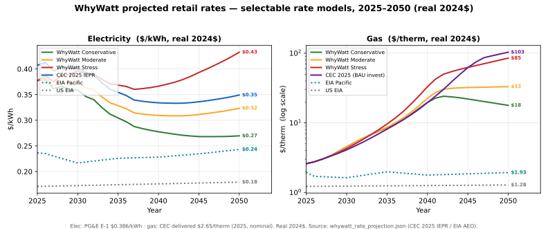
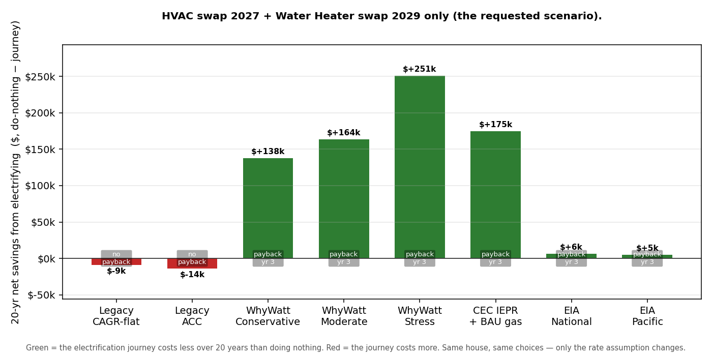
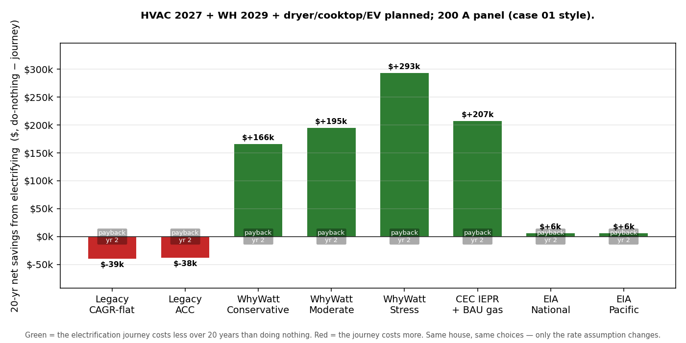
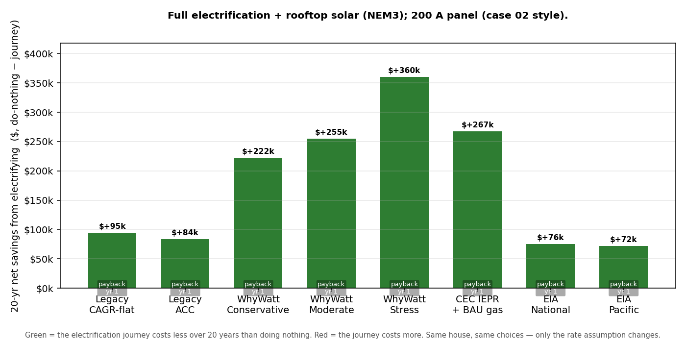
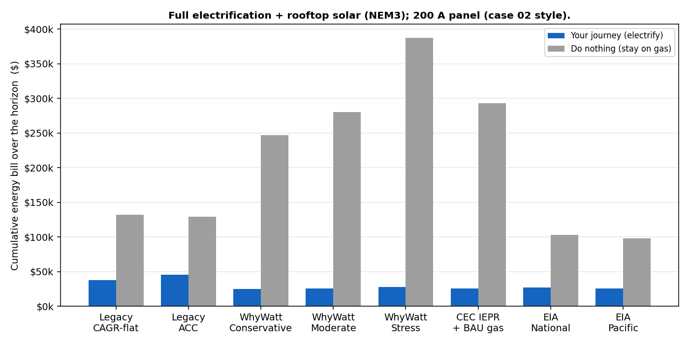
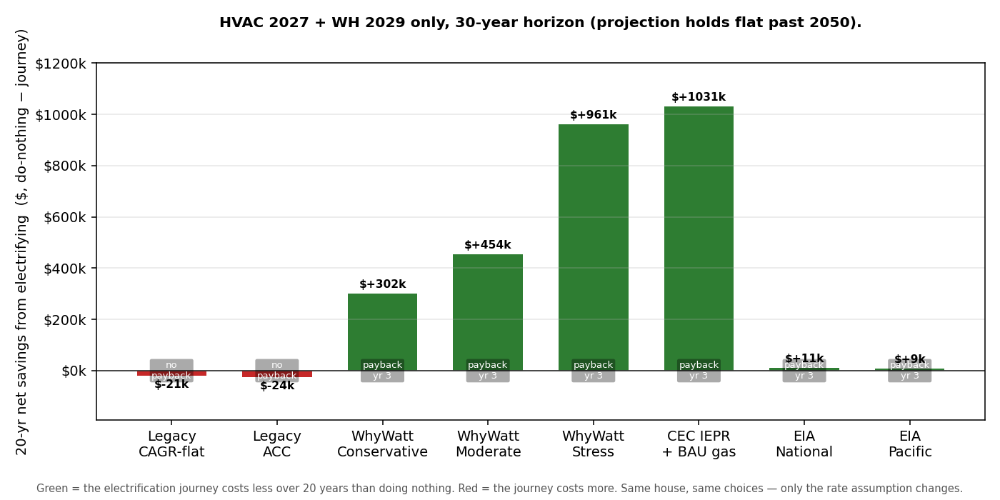

# The Rate Assumption Is the Story: Electrification Cost Impact Across Eight Rate Models

**WhyWatt technical report — DRAFT for manual editing**
_Prepared 2026-09-09 (Phase 6 WS1) · **Re-run 2026-09-24 on Phase 7 + the gas-rate base review**
· Data snapshot: `tests/validation/rate_model_impact.json`. Since Phase 7 every projection starts from
the home's own current rate and the curves supply only the growth; the gas curves now follow the CEC
delivered price (see `docs/GasRateBase_Review_Plan.md`). What changed and why:
`docs/reports/RateModel_Impact_Report_P7_review.md`._

> **Draft status.** This is a working draft assembled from the committed impact snapshot and the
> project's rate-projection guide. Prose marked **[EDITOR NOTE]** flags a decision or a number to
> confirm before this goes to an audience. Charts are generated by
> `scripts/build_impact_report_charts.py`; the rate-curve figure is the same one served with the
> in-app methodology guide.

---

## 1. Introduction — why the rate projection *is* the analysis

When a homeowner asks "will electrifying save me money?", the honest first answer is a question back:
*at what future energy prices?* The cost of an electrification journey is dominated not by the
appliances but by two decades of energy bills, and those bills depend on how the price of
electricity and gas moves between now and mid-century. Get the rate path wrong and every downstream
number — payback, lifetime savings, the whole recommendation — is wrong with it.

The uncomfortable truth is that no one can hand you a single correct future rate. The major
institutions that publish rate outlooks do not agree, and they are not supposed to:

- **US EIA** (Energy Information Administration) publishes the neutral, federal reference. Its Annual
  Energy Outlook keeps both electricity and gas roughly *flat in real terms* nationally, and roughly
  flat even for the Pacific region — because the federal reference case does **not** model
  California's electrification-driven decline of the gas system.
- **The California Energy Commission (CEC)** publishes the state's own official forecast. Its 2025
  IEPR keeps California **electricity** near-flat in real terms, but shows **gas** rates climbing
  steeply for the customers who remain — the "death spiral" — with the severity depending on a policy
  choice about how the state recovers the cost of a shrinking gas system.
- **E3** (Energy + Environmental Economics), the firm that builds California's Avoided Cost
  Calculator, published the foundational gas death-spiral study; its managed high-electrification
  path is an independent high case.
- **PG&E's** own published tariffs are the ground-truth *starting point*: the home's own current
  rate — its utility's time-of-use plan (URDB) or, where there is none, its EIA effective rate —
  which every projection grows from.

The single most important message of this report is therefore not a number but a **shape**: the
near-term, mid-term, and long-term rate outlook is genuinely uncertain, and that uncertainty
**cannot honestly be collapsed to one percentage-per-year**. Near-term California rate pressure
(wildfire cost recovery, grid upgrades) behaves nothing like the long-term picture (a cleaner,
cheaper generation supply and, for gas, a shrinking customer base). A defensible tool has to show a
*range* built from named sources — and then show how the electrification verdict holds up across
that range. That is exactly what the rest of this report does.

---

## 2. Rate projection — sources and method

_This section summarizes the project's living methodology guide,_
_`docs/help/rate_projection_guide.md` (§R1–R3, §R8). The math lives in_
_`docs/Energy_Rate_Projection_Spec.md`._

### 2.1 What the projection does (§R1)

The projection builds the **price side** of the future bill: a schedule of dollars-per-kWh and
dollars-per-therm for every year and month out to 2050. It is deliberately framed as a
**projection under stated assumptions, not a prediction**. Rather than one mystery number, it lays
out a low, a central, and a high path — each anchored to today's real PG&E rate and grown using
published government and expert forecasts — so the reasoning is visible instead of hidden. In the
simulator the curves supply only the *growth*; the level is the home's own current rate.

### 2.2 A growing rate is a *function*, not a single percentage (§R2)

Older tools escalate prices by one fixed percentage a year, forever. WhyWatt instead grows the rate
in **segments** — a near-term rate, a mid-term rate, and a long-term rate — with the curve bending at
the horizons the official forecasts themselves use (around 2030 and 2045). This captures the fact
that the *rate of increase itself changes over time*: near-term wildfire and grid pressure is not
the same force as the long-term supply picture.

### 2.3 How one year's rate is built (§R3)

A California retail rate is **not** the cost of energy plus a markup. WhyWatt builds each year's rate
by **adding two pieces**:

- **Marginal cost** — the true cost of one more unit of energy at that hour (a few cents/kWh), taken
  from the state's official **Avoided Cost Calculator (ACC 2024, built by E3)**.
- **Residual** — everything else the utility must recover: wildfire mitigation, existing poles and
  wires, legacy contracts, public programs. This is the **majority** of the bill.

The two are **added, not multiplied**, and that choice drives the whole result. The residual behaves
like a large fixed pot of cost (the *revenue requirement*) divided across all the energy sold:

> **residual rate ≈ revenue requirement ÷ energy sold**

Two things move it — the revenue requirement rising, and the amount of energy sold changing:

- **Electricity:** sales are *growing* (EVs and heat pumps sell more kWh), and that growth roughly
  **cancels** the rising revenue requirement — so electric rates stay about flat after inflation.
- **Gas:** sales are *shrinking* (homes leave gas), so the same fixed cost lands on fewer therms and
  the rate **climbs**.

Same arithmetic, opposite direction — which is precisely why electricity and gas pull apart over
time.

### 2.4 The sources, in one place (§R8)

| Input | Source | Role in the model |
|---|---|---|
| Marginal cost (elec & gas) | **CPUC ACC 2024** (built by E3), harvested at climate zone CZ4 | Sets the "one more unit" piece; shows the *bill* marginal cost is nearly flat |
| Electricity central line | **CEC 2025 IEPR** electricity rate workbook (PG&E residential, tn=268239) | Drives the WhyWatt electricity scenarios (real-flat ~36¢/kWh 2024$) |
| Gas death-spiral cases | **CEC 2025 IEPR** gas rate workbook (tn=264063, `PG&E Res` sheet, col H "Delivered Price"; Planning-Area + extreme case; real 2024$) | Drives the WhyWatt gas scenarios and the CEC extreme benchmark |
| Independent high case | **E3 (2020)** "Retail Gas in California's Low-Carbon Future" | Second, independent gas-spiral benchmark |
| Federal reference | **US EIA** national average + AEO Pacific | Their *growth* applied to your current rate — a near-flat real outlook |
| Current rate | **URDB** plan (PG&E E-TOU-C) / **EIA-861M & EIA-176** per utility (2025) | Sets today's rate for the home; every projection grows from it |
| Electricity curve anchor & backcast | **PG&E E-1** published tariff (2018→2025) | Anchors the electricity curves; checks the model retraces recent history (gas curves = the CEC delivered price, no anchor) |
| Nominal↔real bridge | **CEC 2023 IEPR GDP deflator** (~2.2%/yr) | The single inflation series used across all sources |

**A note on dollar basis.** The rate *curves* in Section 3 (Figure 1 and its table) are shown in
**real 2024$** — inflation removed with the CEC GDP deflator — because that is the basis the CEC
anchors are published in, so every source compares fairly. The cumulative *bill totals* in Section 4
are **nominal dollars** (what actually appears on a bill, summed over the horizon), which is why they
run larger; the model computes those nominal, and the same deflator can convert them to real if
wanted. Both are labelled where they appear.

---

## 3. Rate projection — results, in plain terms

The figure below plots **every selectable rate model**, both fuels, 2025–2050 (gas on a log scale).



_Figure 1. Projected retail rate for every selectable rate model — the three WhyWatt scenarios plus
the CEC and EIA reference lines — both fuels, 2025–2050 (gas log scale), in **real 2024$** (inflation
removed); each line labelled with its 2050 value. Electricity anchored to PG&E E-1; gas = the CEC
delivered price. Generated from
`whywatt_rate_projection.json` by `scripts/build_guide_charts.py`._

**In plain terms — electricity stays modest; only gas spirals.** All the electricity lines sit in a
narrow band and stay roughly flat in real terms across every model. The gas lines fan out
dramatically. That divergence is the entire economic engine of electrification: you are moving load
off the fuel whose price is climbing and onto the fuel whose price is stable.

**How far gas rises is a policy choice, not physics.** Using the CEC's own gas study (PG&E
residential, today ≈ $2.59/therm in 2024$), the projected **2050** gas rates — in **real 2024$** — are:

| Line | 2050 gas rate | What it represents |
|---|--:|---|
| US EIA national | ~$1.3 | federal reference — no CA death spiral modeled |
| EIA AEO Pacific | ~$1.9 | federal reference, our region — still roughly flat |
| E3 (2020) | ~$7.8 | E3's managed high-electrification path |
| WhyWatt Conservative | ~$18 | CEC managed decline ("pruning" gas spend) |
| WhyWatt Moderate (default) | ~$33 | CEC steadier recovery ("front-load") |
| WhyWatt Stress | ~$85 | CEC business-as-usual spending ("flat") |
| CEC extreme | ~$103 | CEC fast electrification **+** business-as-usual spending (~40×) |

_(All real 2024$. In nominal dollars each gas figure is ~1.7× larger by 2050 — e.g. Moderate ≈
$58.5/therm nominal — which is the basis the Section 4 bill totals are summed in.)_

The federal (EIA) lines stay near today's rate because they don't assume California's gas transition
happens; the CEC cases show what *does* happen to remaining gas customers when it does.

**The anchor thesis (the neutral federal outlook).** When a conversation drifts into "but rates
could do anything," anchor it: run the analysis with the **US EIA outlook** — the home's own current
rate, growing only at the federal pace (roughly flat after inflation, no California gas spiral). As
Section 4 shows, even if prices only follow the federal outlook, electrification **plus solar** saves
**$76k** (EIA national) / **$72k** (EIA Pacific) over 20 years. Any California gas rise only
strengthens the case — but anchoring to the neutral federal outlook keeps the argument defensible and
sidesteps "California is a special case" skepticism.

---

## 4. Impact scenarios

We ran five electrification configurations, each priced under **eight rate models** — two legacy
baselines (flat CAGR and ACC), the three WhyWatt scenarios, the CEC death-spiral case, and the two
EIA reference lines. In every chart below, the bar is the **20-year (or 30-year) net savings from
electrifying**, defined as `do-nothing − journey`: **green means the journey costs less than staying
on gas; red means it costs more.** The same house and the same choices are held fixed within each
chart — *only the rate assumption changes.*

The snapshot deliberately exercises non-default projection paths (it is a validation snapshot, not
the golden run). Reference: `tests/validation/rate_model_impact.md`. **All dollar figures in this
section are nominal cumulative operating bills** — annual bills summed over the horizon, as they'd
appear — not the real 2024$ rate levels of Section 3.

### 4.0 How savings and payback are defined (from the code)

These definitions are taken directly from the model's canonical cockpit extraction
(`_verdict_numbers` in [`src/ui/sim.py`](../../src/ui/sim.py), reading the `"Opex Delta"` reporter
in [`src/model.py`](../../src/model.py) and `cumulative_opex` in
[`src/journey.py`](../../src/journey.py)). Two facts up front:

- **`cumulative_opex` is operating energy cost only** — the sum of each device-slot's yearly energy
  bill, **net of solar savings**. It does **not** include equipment install/capital costs (those are
  tracked separately as `capex_events`/`capex_by_year`), and it does **not** include any
  social/health/carbon adder.
- Let `bill_B(t)` and `bill_J(t)` be the do-nothing and journey cumulative operating bills through
  simulation year `t`. The model's headline delta is

  > **Δ(t) = bill_B(t) − bill_J(t)**  (the `"Opex Delta"` reporter; positive ⇒ the journey is cheaper to run)

  The **Net savings (Δopex)** bars in every chart are `Δ(T)` at the final year `T`.

**Payback year — *without* social cost (this is the value in the snapshot).**
The reported `payback_year` is the **first simulation year `t` (1-indexed) at which `Δ(t)` first turns
strictly positive**, else `—` (never):

```python
delta_vals = df["Opex Delta"].values                     # cumulative bill_B(t) − bill_J(t), per year
payback_yr = next((i + 1 for i, d in enumerate(delta_vals) if d > 0), None)
```

Because it is defined on the operating-bill delta, it counts **only energy bills** — never install
capital, never social cost. And because `Δ(t)` is **not guaranteed to be monotonic**, an early
payback can later *reverse*: the cumulative bill delta can cross zero, go positive, then fall back
negative. That is exactly what happens in the full-electrification cases under flat rates below — the
cheap early appliance swaps put the journey marginally ahead by year 2, but the later heat-pump and
water-heater swaps, expensive to run at a flat ~$0.386/kWh with no rising gas price to escape, pull
the cumulative delta back underwater by year 20. So a reported `payback_year = 2` alongside a
*negative* final Δopex means **"paid back early, then reversed"** — a transient payback, not a durable
one. (This is a genuine artifact of reporting a single payback year for a non-monotonic curve;
consider surfacing "durable payback" — the last crossing — alongside it.)

**Net social cost avoided (reported as a horizon total, not a payback).**
For each year the model values the *avoided* externality of burning less gas and gasoline:

> `social_X(t) = gas_therms_X(t) × total_social_rate + gasoline_gallons_X(t) × gasoline_externality_rate`

where `total_social_rate` (climate + health, per therm) comes from `SocialCostConfig`. The reported
`net_social_cost_avoided` is the **sum over all years** of `social_B(t) − social_J(t)` — the total
societal cost the journey avoids over the horizon. It is added on top of the bill story, not folded
into `Δopex`.

**Payback year — *with* social cost (derived; not currently in the snapshot).**
If the avoided social cost is credited as a benefit, payback is the first year `t` where the
*combined* cumulative position turns positive:

> **first `t` with  Δ(t) + Σ₍s≤t₎ [ social_B(s) − social_J(s) ]  > 0**

Because each year's social term is ≥ 0 (electrifying always burns less gas/gasoline than doing
nothing), the with-social payback is **always ≤ the bill-only payback** — crediting society's avoided
cost can only bring payback *forward*, never push it later. **[EDITOR NOTE]** The tool today reports
the bill-only payback and the social total *separately*; the combined series above is not yet a field
in the snapshot. If a with-social payback is wanted in this report, add that cumulative series to the
cockpit extraction (or compute it from the per-year `Social Total` reporters) rather than inferring
it by hand.

---

### 4.1 HVAC (2027) + Water Heater (2029) only — the partial journey

The lightest journey: swap the furnace/AC for a heat pump in 2027 and the water heater in 2029, and
nothing else. Peak load 78 A → panel status **yellow**. 20-year horizon.



**Key finding.** This is the scenario where the rate assumption changes the *verdict*, not just the
size of the win. Under the legacy fixed-%/yr models the partial journey loses money (−$9k to −$14k,
no payback). Under the federal EIA outlook it is mildly positive (+$5k to +$6k, payback year 3). But
the moment gas is allowed to rise along any CEC-grounded path, the same two swaps save
**$138k–$251k** over 20 years (payback in year 3). The do-nothing baseline is what moves: from
$132k under flat rates to $388k under Stress. **The size of a partial electrification's case is
decided by the gas-rate outlook** — only the legacy fixed-% models, which escalate electricity as fast
as gas, make it negative.

---

### 4.2 Full electrification (HVAC + WH + dryer + cooktop + EV), 200 A panel

The complete journey on an adequate service. Peak load 119 A → panel status **green**. 20-year
horizon.



**Key finding.** Adding the EV and the remaining appliances roughly doubles the avoided social cost
(from ~$20k to ~$42k) and, under every gas-rising model, drives net savings to **$166k–$293k**. Under
the flat-rate legacy models the *operating-bill* delta is slightly negative (−$38k to −$39k), because
the EV adds electric load that flat rates never reward — yet the model still reports a **year-2
payback** across the board. Per §4.0 this is a *transient* payback: the cheap early appliance swaps
put the journey briefly ahead, then the later heat-pump/WH swaps pull the cumulative bill delta back
negative by year 20 (payback year 2, negative final Δopex = "paid back early, then reversed"). Even
under the federal EIA outlook (national and Pacific) it stays **positive** here
(+$6k / +$6k). **Full electrification is a clear win under every California-grounded rate model and
is still positive under the neutral federal outlook.**

---

### 4.3 Full electrification + rooftop solar (NEM3) — the headline

The same full journey with rooftop solar added. Peak load 119 A → panel status **green**. 20-year
horizon.





**Key finding — this is the report's punchline.** With solar, the journey wins under **every single
rate model, without exception**, including the most conservative flat-rate legacy case (+$95k) and
both neutral EIA outlooks (+$76k national, +$72k Pacific). Payback is **year 1** everywhere. The
journey's cumulative bill collapses to $25k–$45k while do-nothing runs $98k–$388k (Figure, lower
panel). This is the concrete backing for the anchor thesis in Section 3: *you do not need to believe
California's gas death spiral for electrification-plus-solar to pay — it pays even if prices only
follow the federal outlook.*

---

### 4.4 Full electrification on a 100 A service — the panel-upgrade trigger

Identical to 4.2 in every dollar, but on an undersized 100 A service. Peak load 119 A → panel status
**red**.


**Key finding.** The operating economics are **identical** to the 200 A case — the rate models don't
know about the panel, because peak load is a function of *use*, not *price*. What changes is the
**red panel status**: a 100 A service forces a panel upgrade, a one-time capital cost and a
feasibility flag that the operating-bill figures here do **not** include. The takeaway for advocates
is to separate the two conversations: the long-run bill story is unchanged, but this household has an
up-front hurdle to plan and finance. **[EDITOR NOTE]** Consider adding the panel-upgrade capital cost
explicitly so this scenario's total-cost story differs from 4.2 as it should.

---

### 4.5 HVAC + WH only, over a 30-year horizon — time amplifies the spiral

The same partial journey as 4.1, extended to 30 years (the projection holds flat past 2050). Peak
load 78 A → panel status **yellow**.



**Key finding.** Lengthening the horizon does not change the *direction* of any result but hugely
amplifies its *magnitude* wherever gas rises. Do-nothing under Stress balloons to **$1.28M** and under
the CEC extreme to **$1.35M**, pushing net savings to **$961k** and **$1.03M** respectively — while the
legacy fixed-%/yr models stay negative (−$21k to −$24k) and the federal outlook is mildly positive
(+$9k to +$11k), as at 20 years. **The longer the horizon, the more the
scenario choice dominates the outcome** — which is the strongest possible argument for showing a range
rather than a single rate.

---

## 5. Conclusion

Across five electrification configurations and eight rate models, one pattern holds:

1. **The rate assumption, not the hardware, decides the answer for partial journeys.** HVAC + water
   heater alone loses money under the legacy fixed-%/yr rates (−$9k to −$14k), is mildly positive
   under the federal outlook (+$5k to +$6k), and is a $138k–$251k winner under any California-grounded
   gas outlook. You cannot answer "should I electrify?" without first choosing a rate story — which is
   why WhyWatt refuses to ship a single mystery percentage.

2. **Full electrification is robust.** Under every California-grounded model it saves $166k–$293k over
   20 years, and under the federal outlook it is still positive (+$6k).

3. **Solar makes the answer unanimous.** With rooftop solar, electrification wins under *every* rate
   model tested — flat, federal, or spiraling — with year-1 payback. This is the defensible headline:
   the recommendation survives the most skeptical, non-California rate assumption available.

4. **Horizon and panel are separate axes.** A longer horizon amplifies the gas-rate divergence
   (30-year savings reach ~$1.0M under the stress and CEC cases — $961k / $1.03M); an undersized panel adds a
   one-time capital hurdle that leaves the long-run bill story unchanged.

The overarching message is the one Section 1 opened with: **the future rate cannot honestly be a
single number, so the tool's job is to show the range and demonstrate that the electrification case
holds across it.** For the conservative, sceptic-proof version of that case, assume prices only follow
the federal outlook and add solar — the answer is still yes (+$72k–$76k over 20 years).

---

_Appendix — reproduce the figures:_
```bash
.venv/Scripts/python.exe scripts/build_guide_charts.py          # Figure 1 (rate curves)
.venv/Scripts/python.exe scripts/build_impact_report_charts.py  # Section 4 bar charts
```
_Underlying data: `tests/validation/rate_model_impact.json` and `...md`._
