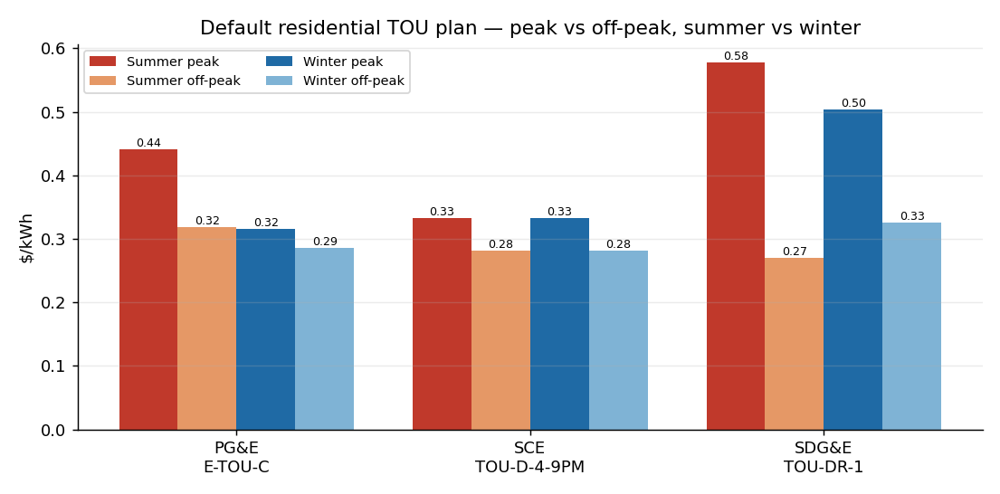
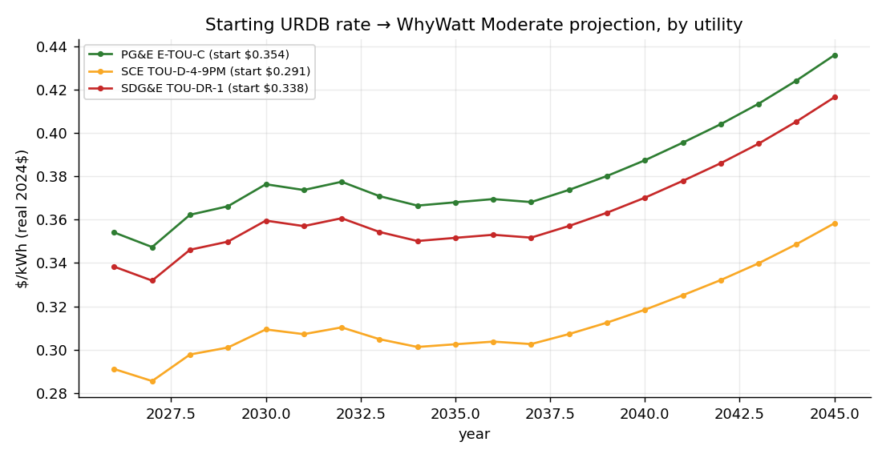

# How the starting electricity and gas rates are determined

*WhyWatt Technical Report · offline rate-data pipeline · generated from the committed
`data/rates/` files. Electric structure from the OpenEI **Utility Rate Database (URDB)**; gas and
rate levels cross-checked against **EIA**; forward trajectory from the WhyWatt rate projection.*

Every WhyWatt simulation starts from a **current, location-specific rate** and then escalates it
forward. This report explains where that starting rate comes from — how a ZIP becomes a utility,
what the URDB gives us for California's three big utilities, how rates move across the day and the
seasons, and how the simulation projects them into the future.

---

## 1. From ZIP code to utility

The user enters a **ZIP code**. WhyWatt resolves it to the household's **electric utility** and
**gas provider** with no network call, using committed lookup tables:

- **Electric:** the OpenEI / NREL *"U.S. Electric Utility Companies and Rates: Look-up by Zip Code
  (2024)"* dataset (`iou_zipcodes_2024.csv`, built on EIA-861). It maps each ZIP to one or more
  **EIA-861 utility numbers**; a border ZIP may list two utilities and the resolver picks
  deterministically.
- **Gas:** the gas distribution company is derived from the electric territory for California's
  metros (PG&E electric → PG&E gas, SCE area → SoCalGas, SDG&E → SDG&E gas).

The **EIA-861 utility number** is the linchpin: it is the same key the URDB, the EIA rate database,
and the coverage list all use — so once we know the utility, every downstream table joins with no
extra crosswalk. If a ZIP resolves to a municipal utility or co-op we do not price (e.g. SMUD,
LADWP), or does not resolve at all, the model falls back to the **California statewide average**.

> **Can we even *use* a URDB rate here?** OpenEI keeps ~114 utilities (≈70% of US electricity load)
> updated annually and warns that rates for utilities *not* on that list should not be assumed
> current. WhyWatt bakes that list and gates on it: a resolved utility is priced from URDB only when
> it is on the maintained list **and** we have harvested it; otherwise it falls back to the EIA rate.

---

## 2. What the URDB gives us

The **URDB** is a public, quality-controlled database of real, published electricity tariffs. For a
utility we retrieve every approved residential tariff, then curate the hundreds of raw records
(historical, closed, per-territory, income-qualified) down to the current **flagship plans** a
household would recognize, tagging one **default** (a time-of-use plan). For each plan we extract the
full **rate structure**: the peak/off-peak hours, the peak and off-peak price in every month, the
tiered "baseline" allowances, and the fixed charge.

**URDB is electricity only** — it contains no natural-gas tariffs. **Gas rates therefore come from
EIA** (per-utility revenue ÷ volume, the all-in price households actually pay), escalated the same
way (§4). Gas is billed as a single seasonal rate — no time-of-use.

### California's three utilities

| Utility | Territory | Default plan | Character |
|---|---|---|---|
| **PG&E** (Pacific Gas & Electric) | Northern & central CA | **E-TOU-C** | moderate rates; 10 climate "baseline territories" |
| **SCE** (Southern California Edison) | LA basin, inland SoCal | **TOU-D-4-9PM** | flattest of the three; TOU default has no baseline tier |
| **SDG&E** (San Diego Gas & Electric) | San Diego county | **TOU-DR-1** | the most expensive, with the steepest peak/off-peak spread |

The table below is the headline output of the harvest — the **actual summer/winter, peak/off-peak
price (tier-1) for every flagship plan** of all three utilities (★ = the default the simulation
uses when none is chosen):

<!--RATE_TABLE-->

The EV plans show the widest peak-to-off-peak spread (SDG&E EV-TOU-5 is over 6×), a deliberate signal
to charge overnight. The tiered legacy plans (E-1, SCE Domestic, SDG&E DR) have no time-of-use, so
their peak and off-peak prices are identical.

---

## 3. How rates change across the day and the seasons

A modern residential tariff is not one number. It varies **within the day** (a ~4–9 pm **peak** when
the grid is stressed, vs cheaper **off-peak** hours) and **across the year** (summer peaks are higher
than winter). The chart below shows both dimensions at once for each utility's default plan:

Reading it: within any utility, the **peak bar towers over the off-peak bar** — that is the daily
signal to shift usage off-peak. Comparing the summer pair to the winter pair shows the **seasonal**
swing — largest for PG&E and SDG&E, whose summer peaks jump well above winter. SCE is nearly flat on
both axes. These are the real published prices; the simulation splits each device's monthly kWh into
peak and off-peak using its hourly usage shape, then prices each bucket at the rates shown here.

*(A second location effect sits underneath these prices: the **baseline allowance** — how many kWh
per day are billed at the cheaper tier-1 rate before tier-2 kicks in. It is set by the utility's
climate territory, which WhyWatt resolves from the ZIP's CEC climate zone. For PG&E it ranges from
~6 kWh/day on the cool coast to ~19 kWh/day in the hot Central Valley.)*

---

## 4. How the simulation uses the rate: starting point + projection

The URDB rate is the **starting point** — today's real, location-specific price. WhyWatt then
**projects it forward** across the simulation horizon using the rate-escalation model (built in
Phase 6): a scenario-driven trajectory grounded in historical CAGR and CEC/EIA benchmarks, with
**Moderate** as the default.

The chart below takes each utility's **default URDB rate as the 2026 starting value** and carries it
forward under the **WhyWatt Moderate** projection — one effective curve per utility:

Two things the chart makes clear:

1. **The starting point is utility-specific.** The three curves begin at different 2026 values —
   this is exactly what the URDB harvest buys us over a single statewide average: SDG&E starts well
   above PG&E, which starts above SCE.
2. **The projection is a shape applied on top.** All three rise on the same Moderate trajectory
   (real-dollar, roughly flat near-term then climbing), so the utility differences persist across the
   whole horizon.

Gas follows the same pattern: an EIA-sourced starting level escalated by the projection (a separate,
steeper gas trajectory), billed as a single seasonal rate with no time-of-use.

---

## Sources & provenance

- **ZIP → utility:** OpenEI/NREL *U.S. Electric Utility Companies and Rates: Look-up by Zip Code
  (2024)*; gas territory derived for CA metros.
- **Electric rate structure:** OpenEI **Utility Rate Database (URDB)**, approved residential tariffs,
  harvested offline with per-tariff provenance (source params + response sha256).
- **Coverage gate:** OpenEI's annually-maintained utility list (~114 utilities, ≈70% of US load).
- **Rate levels cross-check & gas:** **EIA-861** (electric) and **EIA-176** (gas), revenue ÷ sales.
- **Projection:** WhyWatt rate-projection bundle (Phase 6), Moderate scenario; **EIA AEO Pacific** and
  CEC benchmarks.
- **Baseline territory:** ZIP → CEC Building Climate Zone → utility baseline territory (SDG&E exact;
  PG&E climate-approximate).

*Reproduce: `scripts/build_zip_utility_map.py`, `build_urdb.py`, `build_urdb_coverage.py`,
`build_baseline_crosswalk.py`, then `build_urdb_report.py`. No live API calls at simulation runtime.*
